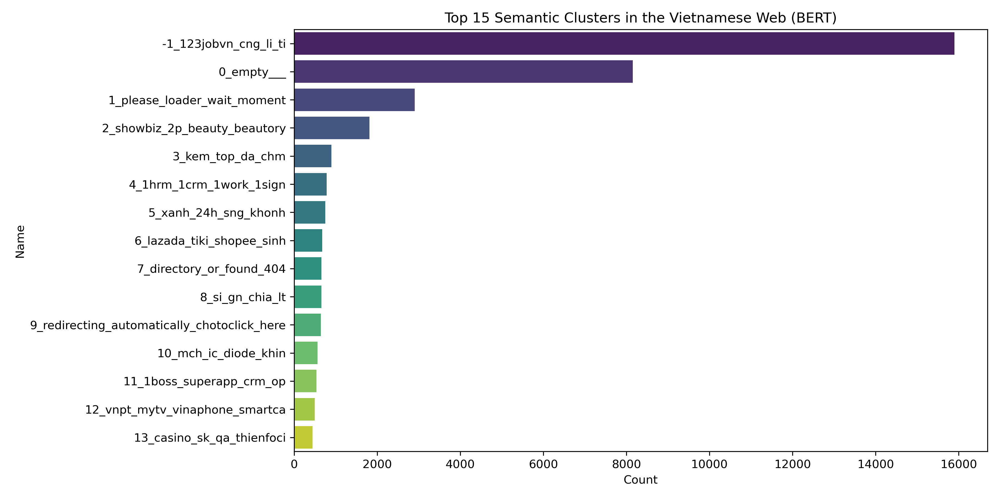
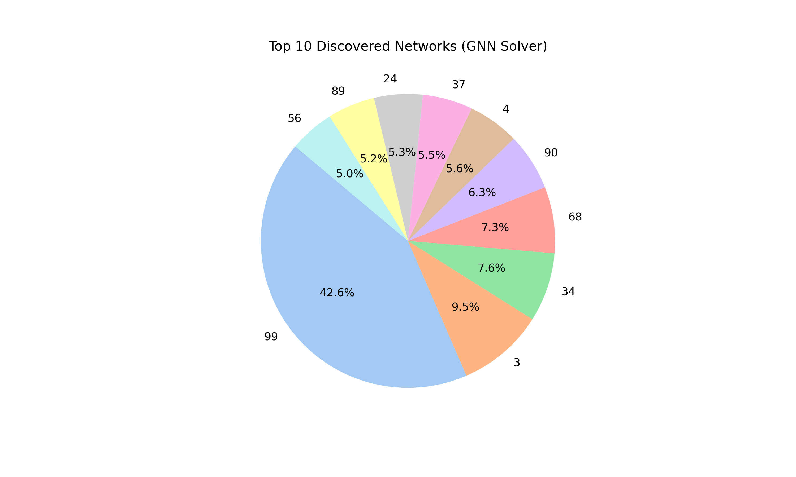
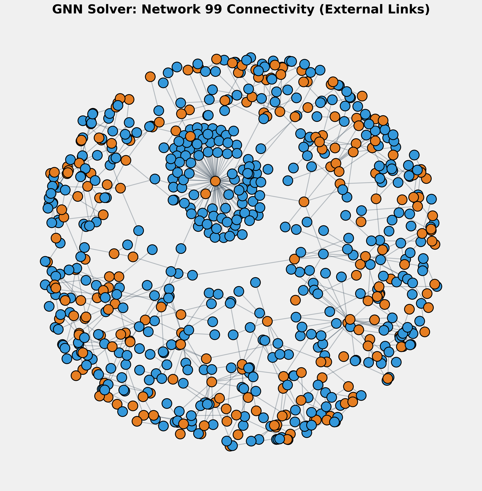

# Graph-Aware Detection of Coordinated Web Entities in the Vietnamese Internet

Unsupervised discovery of large-scale templated and coordinated web infrastructure using structural, semantic, and identity signals.

## Overview

Modern web integrity and trust & safety systems often struggle with non-English content due to data scarcity, linguistic diversity, and templated evasion tactics. This project introduces a scalable, unsupervised pipeline that processes large volumes of raw HTML from Vietnamese web sources to detect coordinated clusters — including potential phishing kits, content farms, Sybil networks and large centralized web infrastructures.

**Key results**:
- Processed **81,593 raw HTML pages** (~14 GB) from .vn domains and re-fetched Common Crawl Vietnamese subset.
- Identified **Network 99** (9,661 pages, ~11.8% of corpus) as a dominant coordinated entity exhibiting:
  - Extreme template reuse (cross-domain Jaccard similarity 0.519)
  - 1,157 unique Google Analytics IDs
  - Uniform assignment to semantic Topic -1 (noise/outliers)
  - Heavy local registrar concentration (~65–70%) and privacy/locking (~86%)
  - Hub-and-spoke connectivity pattern with zero internal edges

The pipeline leverages high-performance computing, multilingual NLP, heterogeneous graphs, and graph neural networks to reveal hidden structure in underrepresented web content.

## Visualizations

### Top 15 Semantic Clusters (BERTopic)
The dominant Topic -1 (noise/outliers) contains a large volume of low-coherence or templated content — a hallmark of suspicious clusters.



### Top 10 Discovered Networks by Size (GNN Clustering)
Network accounts for a disproportionate share of the corpus — a clear structural outlier.



### Network Connectivity Sample
Orange nodes represent pages inside Network 99; blue nodes represent external pages.  
Dense external spokes + zero internal edges suggest a hub/authority cluster with mass-produced pages exporting connectivity or traffic.




## Pipeline Overview

1. **Data Collection** (`data_collection_vi.ipynb`)  
   - Queries Common Crawl CDX Index API for `*.vn/*` URLs  
   - Paginated retrieval with deduplication  
   - Saves URLs, WARC filenames, offsets, lengths to CSV

2. **Feature Extraction** (`src/features/extract.py`)  
   - Parallel HTML parsing on NUS Atlas8 HPC (24 cores)  
   - Extracts cleaned text, tag counts, GA/pub IDs, form density, etc.  
   - Output: `processed_features.parquet` (~55–100 MB)

3. **Semantic Clustering** (`src/clustering/bertopic_cluster.py`)  
   - Multi-process embeddings (`paraphrase-multilingual-MiniLM-L12-v2`)  
   - BERTopic + UMAP + HDBSCAN clustering  
   - Output: topic labels in `semantic_results.parquet` + saved model

4. **Graph Construction** (`src/graph/build_graph.py`)  
   - 4.02 million edges fusing:  
     - Identity (shared GA IDs)  
     - Semantic (shared topics)  
     - Structural (identical/near-identical tag fingerprints)  
   - Output: `graph_edges.parquet`

5. **GNN Fingerprinting & Clustering** (`src/models/train_gnn.py`)  
   - Unsupervised GraphSAGE with positive-edge link reconstruction → 32-dim structural embeddings 
   - MiniBatchKMeans → 99 network ecosystems  
   - Output: `gnn_solver_results.parquet` with `network_id` and fingerprint dimensions

6. **Analysis & Validation** (`src/analysis/`)  
   - Redirect tracing, DOM tag-set similarity (Jaccard), WHOIS bulk lookup  
   - GA ID diversity ranking, cross-domain sibling analysis  
   - BERTopic topic inspection

7. **Visualization & Reporting** (`src/analysis/`)  
   - Topic distribution, network size pie chart, Network topology

## Reproducing the Pipeline

The following steps assume you have cloned the repository and set up the environment.

1. **Install dependencies**  
   Create and activate the environment from the exported spec:

   ```bash
   # Preferred: full conda environment (exact versions from HPC)
   conda env create --file environment.yml
   conda activate myenv

   # Alternative: pip-only (minimal set)
   pip install -r requirements.txt
   ```

2. **Step 1: Data Collection**  
   Collect Vietnamese URLs from Common Crawl CDX index:

   ```bash
   jupyter notebook data_collection_vi.ipynb
   ```

   Or execute non-interactively:

   ```bash
   jupyter nbconvert --to notebook --execute data_collection_vi.ipynb --output executed_data_collection.ipynb
   ```

   Output: `vi_commoncrawl_urls.csv`

3. **Step 2: Feature Extraction**  
   Parse raw HTML into structured features:

   ```bash
   python src/features/extract.py \
       --vn-dir raw_data/vi_html \
       --non-vn-dir raw_data/html_mc4_current \
       --output processed_features.parquet
   ```

   (Adjust paths to match your local directory layout.)

4. **Step 3: Semantic Clustering (BERTopic)**  
   Compute topic labels:

   ```bash
   python src/clustering/bertopic_cluster.py \
       --input processed_features.parquet \
       --output outputs/semantic_results.parquet \
       --model-dir outputs/bertopic_model \
       --batch-size 128
   ```

5. **Step 4: Graph Construction**  
   Build the heterogeneous graph:

   ```bash
   python src/graph/build_graph.py \
       --input final_gnn_features.parquet
       --output outputs/graph_edges.parquet
   ```
   final_gnn_features.parquet must contain merged structural and semantic features (including GA IDs, topic labels, and tag fingerprints).
   
7. **Step 5: GNN Fingerprinting & Clustering**  
   Train GraphSAGE and assign network IDs:

   ```bash
   python src/models/train_gnn.py \
       --features outputs/final_gnn_features.parquet \
       --edges outputs/graph_edges.parquet \
       --output outputs/gnn_solver_results.parquet \
       --epochs 50 \
       --batch-size 10000
   ```

8. **Step 6: Analysis & Validation** (run any or all)  

   ```bash
   # Redirect check
   python src/analysis/check_redirects.py \
       --input outputs/gnn_solver_results.parquet \
       --sample 200

   # DOM similarity
   python src/analysis/dom_similarity.py \
       --input outputs/gnn_solver_results.parquet \
       --sample-size 100

   # WHOIS lookup
   python src/analysis/whois_lookup.py \
       --input suspicious_network99_domains.txt \
       --output outputs/network99_whois.csv

   # GA ID sybil ranking
   python src/analysis/detect_sybil_networks.py \
       --input outputs/gnn_solver_results.parquet
   ```

9. **Step 7: Visualization**  
   Generate plots:

   ```bash
   python src/analysis/visualize_results.py \
       --gnn-results outputs/gnn_solver_results.parquet \
       --topic-dict outputs/topic_dictionary.csv \
       --edges outputs/graph_edges.parquet \
       --output-dir outputs/viz

   python src/analysis/viz_topology.py \
       --gnn-results outputs/gnn_solver_results.parquet \
       --edges outputs/graph_edges.parquet \
       --output outputs/viz/network_99_connectivity.png
   ```
   
## Limitations

- **Positive-only link reconstruction loss**:  
  The current GraphSAGE training objective optimizes structural affinity for observed edges only. It does not explicitly penalize non-edges via negative sampling. As a result, embeddings primarily reflect structural cohesion rather than full contrastive separation.

- **Homogeneous edge modeling**:  
  Although the graph encodes multiple relation types (identity, semantic, structural), the current GNN treats the graph as homogeneous. Relation-aware message passing (e.g., R-GCN or edge-conditioned convolutions) is left for future work.

- **Minimal node features**:  
  The current GNN uses compact scalar features (topic ID) rather than the full structural and identity feature space extracted earlier in the pipeline. This was a deliberate trade-off for scalability and CPU training stability.

- **Unsupervised setting**:  
  The discovered networks represent structural ecosystems, not confirmed malicious entities. Additional manual inspection or downstream classifiers would be required for operational deployment.

- **Common Crawl bias**:  
  The dataset reflects the subset of Vietnamese pages indexed by Common Crawl and may not fully represent the broader Vietnamese web.

## Future Work

Planned extensions include:

- Future work will extend the positive-edge objective to full contrastive link prediction via negative sampling to encourage embedding separation between unconnected nodes.
- Modeling heterogeneous edge types explicitly via relational GNNs.
- Expanding node features to include structural density, form frequency, and identity entropy metrics.
- Scaling the pipeline to larger multilingual corpora.
- Introducing temporal analysis to detect evolving coordinated infrastructure.
